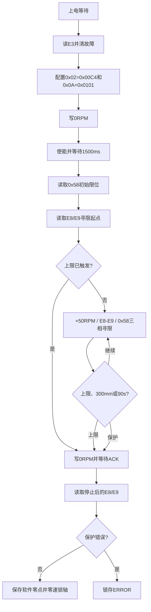

# TSDA 速度模式代码设计说明

## 文档定位

本文是 TSDA 速度模式源码的设计入口，说明模块边界、状态机、不变量和代码映射。功能变更时应先更新本文与对应阶段测试说明，再修改源码和执行实机验证。

当前实现阶段：Chassis + CAN1 + 速度模式上限寻限。尚未实现寻限后回位、目标高度和正常速度规划，`ready` 固定为0。

## 代码映射

| 职责 | 文件 | 约束 |
|---|---|---|
| 厂家CAN协议 | `Driver_User/driver_tsda_servo.c/.h` | 不包含状态机、硬件变体、HAL或CAN通道 |
| 初始化和运动状态机 | `App_User/app_tsda_servo.c/.h` | 只通过Driver访问寄存器，不直接访问FDCAN |
| CAN1发送适配和1ms调度 | `Task_User/task_motor.c` | 只绑定接口，不解析TSDA协议 |
| CAN1接收入口 | `BSP_User/bsp_fdcan.c` | 中断只调用唯一的 `TSDA_AppOnCanRx()` |
| 阶段实测 | `docs/TSDA速度模式第一阶段测试说明.md`、`docs/TSDA速度模式第二阶段测试说明.md` | 每阶段实机通过后再继续扩展 |

## Driver协议契约

命令帧 CAN ID 为从站号，当前是 `0x01`；回包 CAN ID 为从站号加 `0x100`，当前是 `0x101`。数据固定8字节：

| 字节 | 含义 |
|---|---|
| Byte0 | 组号，当前为0 |
| Byte1 | `0x1A`写、`0x1B`写ACK、`0x2A`读、`0x2B`读回包 |
| Byte2 | 寄存器1地址 |
| Byte3:4 | 寄存器1大端16位数据 |
| Byte5 | 寄存器2地址，单寄存器命令使用 `0xFF` |
| Byte6:7 | 寄存器2大端16位数据 |

Driver 的“发送成功”只表示板级 CAN 接口接受了帧，不表示驱动器已经执行。初始化步骤必须等待严格匹配 CAN ID、组号、功能码和寄存器地址的回包。

## App状态流程

## 三相节拍

`MotorTask` 每1ms调用一次 `TSDA_AppUpdate()`。寻限状态的完整周期是3ms：

1. phase0：向 `0x10` 写 `+50RPM`。
2. phase1：读取 E8/E9 原始位置。
3. phase2：读取 `0x58` 限位状态。

上限回包在下一次 `TSDA_AppUpdate()` 开始时处理。回包一旦表明上限触发，该次更新会直接进入停止状态并写 `0RPM`，不会再发送下一拍 `+50RPM`。

上限成功后的保持周期同样为3ms：写 `0RPM`、读 E8/E9、读 E4。

## 关键不变量

- Driver 永远不知道 Chassis、3Pin、CAN1 或 CAN2。
- 当前板级适配只使用 CAN1，不增加第二个 TSDA 接收函数。
- 使能前必须先收到 `0RPM` 写ACK。
- Chassis 抱闸由驱动器随使能自动释放，App不控制GPIO也不等待MCU抱闸时序。
- 软件零点只在上限触发、零速停止、最终E8/E9回包完成后有效。
- 寻限成功前 `ready=0`，后续通信目标不得参与运动。
- 上限、300mm和90s三条退出路径都先写 `0RPM`，再离开非零速度状态。
- 底层发送失败且最后命令非零时，ERROR入口必须尽力补发一次 `0RPM`。
- `0x58` 只表示限位状态，与抱闸无关。
- CAN中断只缓存帧，协议解析和状态跳转只发生在1ms任务。

## FreeMASTER可观测性

`tsda_app_state` 表示当前状态；`tsda_status` 保存CAN计数、原始位置、实际和命令转速、限位、寻限时间/行程、软件零点及错误码。通信层和FreeMASTER应把状态字段视为只读，当前仅允许写 `tsda_command.servo_enable`。

## 变更规则

1. 先在本文写明新增状态、进入条件、退出条件和安全不变量。
2. 更新对应阶段测试说明及FreeMASTER判定变量。
3. 修改Driver时只表达厂家协议能力；修改硬件接口时只进入板级适配层。
4. 编译固件，并用 `-Wall -Wextra -Werror` 单独检查TSDA源码和测试源码。
5. 完成实机测试并记录结果后，才开始下一阶段。

